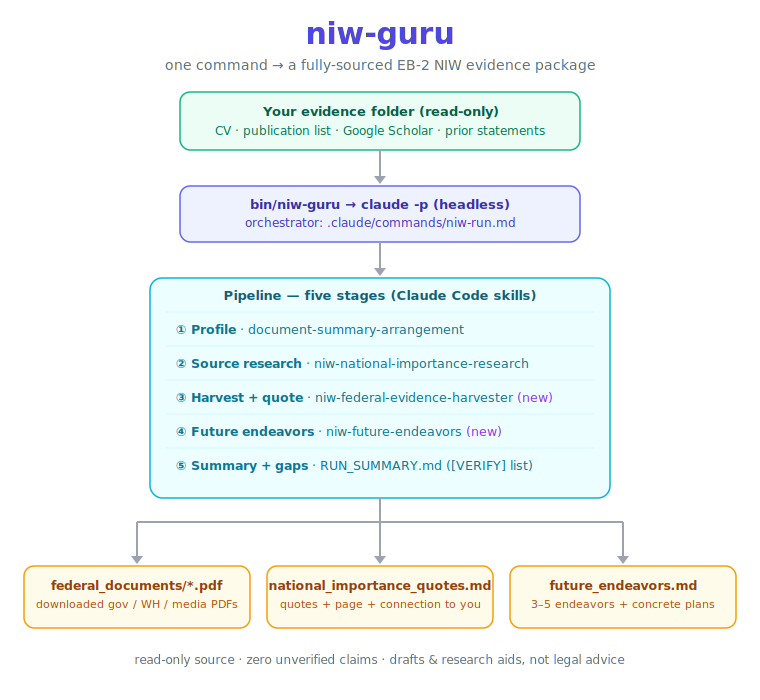

<div align="center">

# niw-guru

**One command turns your research materials into the evidence core of an EB-2 NIW petition.**

[](LICENSE)
[](https://docs.anthropic.com/en/docs/claude-code)
[](src/niw-guru.in)
[](CHANGELOG.md)
[](CONTRIBUTING.md)




</div>

> [!WARNING]
> **niw-guru is not a law firm and does not provide legal advice.** It produces *drafts and
> research aids* from public sources and your own materials — not a filed petition and not legal
> representation. **Have a licensed immigration attorney review your petition before filing.**
> See the [Disclaimer](DISCLAIMER.md).

`niw-guru` is a ready-to-use [Claude Code](https://docs.anthropic.com/en/docs/claude-code) agent
for STEM self-petitioners filing an EB-2 **National Interest Waiver**. Point it at a folder of
your own materials and it researches, downloads, and assembles the forward-looking, fully-sourced
national-importance record the petition is built on.

**For complete product, please visit [NIW Guru](https://niwguru.com/).**

```bash
niw-guru -s ~/my_niw_materials
```

That single command produces, in `output/<run-name>/`:

| Deliverable | What it is |
|---|---|
| **`federal_documents/*.pdf`** | Every relevant U.S. government, White House, Congress, national-lab, and reputable-media source — **downloaded as PDF**. |
| **`national_importance_quotes.md`** | **Exact quotes** from those PDFs, each with its **page location** and a written explanation of **how it connects to your background and proposed endeavor**. |
| **`future_endeavors.md`** | **3–5 concrete future endeavors** with implementation plans (objective, approach, sub-aims, milestones), each aligned to **your expertise** *and* the **national interest**. |
| **`partial_petition_letter_draft.md`** | The three above, woven into the **core of the petition letter**: your background → the national importance → **how each endeavor advances the specific evidence found** (Dhanasar Prongs 1–3). A partial draft, not a filing-ready letter. |
| `RUN_SUMMARY.md` | What ran, what was found, and everything to verify before filing. |

## Contents

- [Why niw-guru](#why-niw-guru)
- [What you provide](#what-you-provide)
- [Install](#install)
- [Usage](#usage)
- [How it works](#how-it-works)
- [Output](#output)
- [Project layout](#project-layout)
- [Try the example](#try-the-example)
- [Roadmap](#roadmap)
- [Contributing](#contributing)
- [Security & privacy](#security--privacy)
- [Disclaimer](#disclaimer)
- [License & acknowledgments](#license--acknowledgments)

## Why niw-guru

Most "AI for immigration" tools start from a blank prompt and happily invent citations. niw-guru
is built the opposite way, around two principles a self-petitioner can't afford to get wrong:

- **Evidence traceability.** Every factual claim in the output traces to a file you supplied or a
  source it actually downloaded. Quotes are copied verbatim with a real page number.
- **Honest gaps.** Anything it can't verify is marked `[VERIFY]` and listed for you — it never
  fabricates a source, quote, page, or statistic.

It also encodes the *current* standard: the Jan 2025 USCIS update (PA-2025-03) and the **Critical
& Emerging Technologies** "strong positive factor" for advanced-STEM petitioners.

## What you provide

Put whatever you have into one folder and pass it with `-s`:

- Your **CV / résumé**
- Your **publication list** and/or a **Google Scholar** export (PDF, saved HTML, or just the URL in a `.txt`)
- Any **prior research / personal statements**, proposed-endeavor drafts
- **Awards, patents, grants, offers, recommendation letters** you already have

The folder is treated as **read-only** — niw-guru never edits your originals; everything it
creates goes under `output/`.

## Install

There's **no prebuilt binary** — you build the `niw-guru` command from source (it's a bash
script; "building" just renders it and links it onto your PATH). Three steps:

**Requirements:** [Claude Code](https://docs.anthropic.com/en/docs/claude-code) (`claude` on your
PATH), `git`, `poppler` (PDF tools), and — to capture web pages as PDFs — Google Chrome /
Chromium or `wkhtmltopdf`.

```bash
# 1. get the code
git clone https://github.com/<your-username>/niw-guru.git
cd niw-guru

# 2. install dependencies + the immigration skills
./setup.sh

# 3. build the command (and, optionally, put it on your PATH)
make build
sudo make install      # optional — or just run ./bin/niw-guru
```

No `make`? Build it by hand:

```bash
mkdir -p bin
sed "s|@NIW_GURU_HOME@|$(pwd)|g" src/niw-guru.in > bin/niw-guru && chmod +x bin/niw-guru
```

`setup.sh` installs `poppler`, checks for an HTML→PDF renderer, and installs the
[`claude_immigration_attorney`](https://github.com/juntoku9/claude_immigration_attorney) skills.
**Full build options, PATH choices, and troubleshooting: [INSTALL.md](INSTALL.md).**

## Usage

```text
niw-guru -s <evidence_dir> [options]

  -s, --source <dir>   Folder of YOUR materials (required; read-only input)
  -o, --output <dir>   Where runs are written        (default: ./output)
  -n, --name <name>    Name for this run's subfolder  (default: <src>-<timestamp>)
      --yes            Unrestricted run (skips all permission checks)
      --dry-run        Show what would run, then exit
  -h, --help           Help
```

> Type `niw-guru` if you ran `make install`; otherwise run `./bin/niw-guru` from the project folder.

```bash
niw-guru -s ~/my_niw_materials                 # autonomous (scoped tool allowlist)
niw-guru -s ~/my_niw_materials --yes           # unrestricted (skips all permission checks)
./bin/niw-guru -s ./examples/sample-run/input --dry-run
```

`claude -p` runs headless, so there are no interactive prompts: by default a pre-approved tool
allowlist (web search/fetch, file writes, PDF tooling) governs the run; `--yes` removes the
allowlist entirely for the most hands-off run. A full run does live web research and downloads,
so it can take a while and uses your Claude Code session.

## How it works

`bin/niw-guru` (built from [`src/niw-guru.in`](src/niw-guru.in)) is a thin launcher that drives
the `claude` CLI through a six-stage pipeline
([`.claude/commands/niw-run.md`](.claude/commands/niw-run.md)), composed of skills:

```
your materials ─▶ 1. Profile          (document-summary-arrangement)
                  2. Source research   (niw-national-importance-research)
                  3. Harvest + quote   (niw-federal-evidence-harvester)  ─▶ federal_documents/*.pdf
                                                                            national_importance_quotes.md
                  4. Future endeavors  (niw-future-endeavors)            ─▶ future_endeavors.md
                  5. Petition letter   (synthesize 1–4)                  ─▶ partial_petition_letter_draft.md
                  6. Summary + gaps                                      ─▶ RUN_SUMMARY.md
```

[`niw-federal-evidence-harvester`](.claude/skills/niw-federal-evidence-harvester) and
[`niw-future-endeavors`](.claude/skills/niw-future-endeavors) are authored here; the rest are
installed from the immigration-attorney skills repo. See
[`docs/how-it-works.md`](docs/how-it-works.md) for the full pipeline and permission model.

### Beyond the one command

After a run, the installed skills take you further (run them in `claude` interactively):
`/case-strength-assessor` (rate the Dhanasar prongs), `/niw-petition-narrative` (draft the
petition letter), `/expert-letter-drafter` (recommendation letters), `/petition-audit`
(line-by-line fact check), `/rfe-response-drafter` (if an RFE arrives).

## Output

Every run writes to `output/<run-name>/` — the four deliverables plus the intermediates
(`petitioner_profile.md`, `evidence-index.md`, `national_importance_research.md`) and
`RUN_SUMMARY.md`. Read `RUN_SUMMARY.md` first; it carries the consolidated `[VERIFY]` list.
Full format reference: [`docs/output-format.md`](docs/output-format.md).

## Project layout

```
niw-guru/
├── src/niw-guru.in              # launcher SOURCE — built into bin/niw-guru (see INSTALL.md)
├── Makefile                     # make build / install / setup / test / clean
├── setup.sh                     # installs PDF tools + the immigration skills
├── bin/                         # the built command lands here (git-ignored)
├── .claude/
│   ├── commands/niw-run.md      # the pipeline orchestrator
│   ├── settings.json            # scoped tool allowlist for autonomous runs
│   └── skills/                  # niw-federal-evidence-harvester, niw-future-endeavors (+ installed)
├── knowledge/                   # NIW best-practices + current-standard research note
├── templates/                   # output templates the skills fill in
├── docs/                        # getting-started, how-it-works, output-format, architecture.svg
├── examples/sample-run/         # a tiny synthetic example (no real person)
├── tests/                       # offline checks for the launcher + helper scripts
└── output/                      # your runs land here (git-ignored)
```

## Try the example

The repo ships a fully **synthetic** profile (a fictional energy-storage researcher) so you can
see the shape of a run without real data:

```bash
./bin/niw-guru -s ./examples/sample-run/input -o /tmp/niw-smoke --yes
```

Compare the result against the illustrative files in
[`examples/sample-run/output/`](examples/sample-run/output). See
[`docs/getting-started.md`](docs/getting-started.md) for a walkthrough.

## Roadmap

- [ ] Optional one-shot petition-letter draft at the end of a run (`niw-petition-narrative`)
- [ ] EB-1A variant of the pipeline
- [ ] Per-source citation export (BibTeX / CSV) alongside the quote bank
- [ ] CI matrix coverage for Linux renderers (Chromium / wkhtmltopdf)

Ideas and issues welcome — see [Contributing](CONTRIBUTING.md).

## Contributing

PRs and issues are welcome. Start with [`CONTRIBUTING.md`](CONTRIBUTING.md) for the repo
conventions (skill structure, the read-only-evidence and zero-unverified-claims rules, and how to
run the tests). Please follow the [Code of Conduct](CODE_OF_CONDUCT.md).

```bash
tests/run-tests.sh        # static checks + offline helper tests
```

## Security & privacy

niw-guru runs locally and your documents stay on your machine; only the research queries and
downloads leave it. There is no telemetry. To report a vulnerability or a privacy concern, see
[`SECURITY.md`](SECURITY.md).

## Disclaimer

niw-guru is **not** a law firm and does **not** provide legal advice or representation. It
generates draft work product and research aids from public sources and your own materials. U.S.
immigration law is complex and changes; outputs may contain errors and must be independently
verified. **Have a licensed immigration attorney review any petition before you file it.** Using
niw-guru does not create an attorney–client relationship. Full text: [`DISCLAIMER.md`](DISCLAIMER.md).

## License & acknowledgments

[MIT](LICENSE). Built on the
[`claude_immigration_attorney`](https://github.com/juntoku9/claude_immigration_attorney) skills.
niw-guru is an independent project and is not affiliated with USCIS or any government agency.
